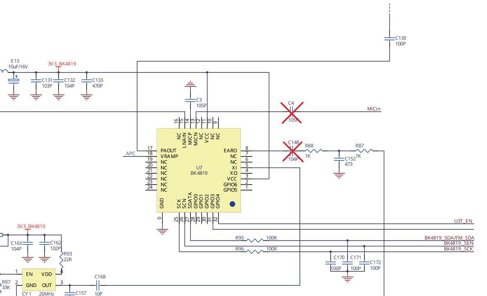
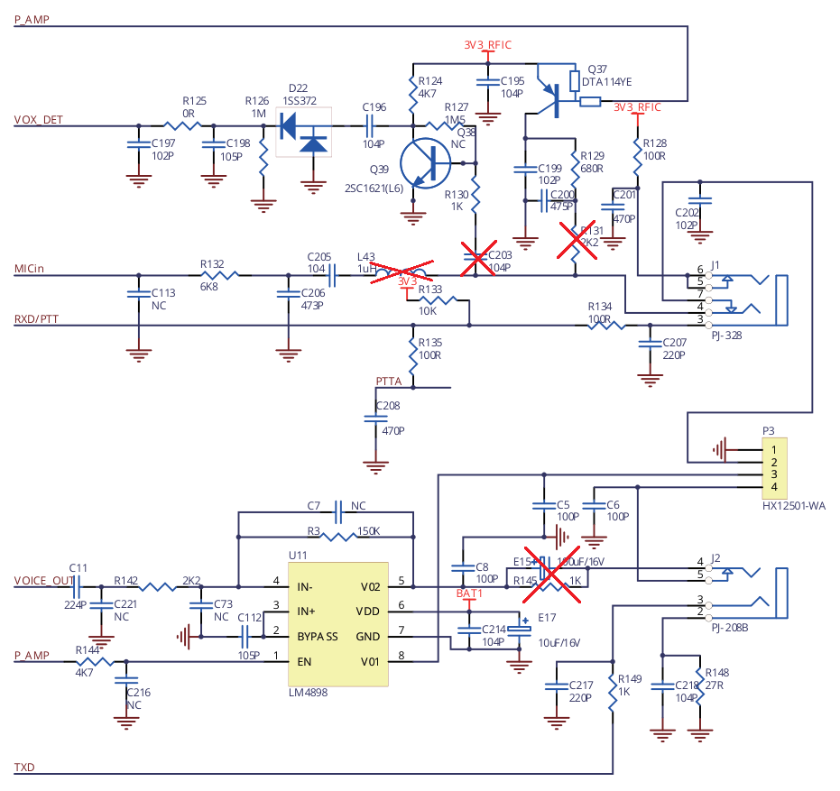
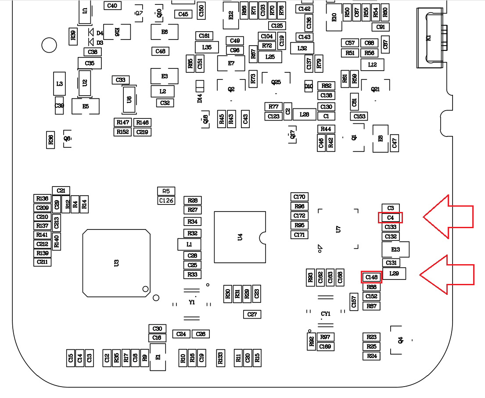
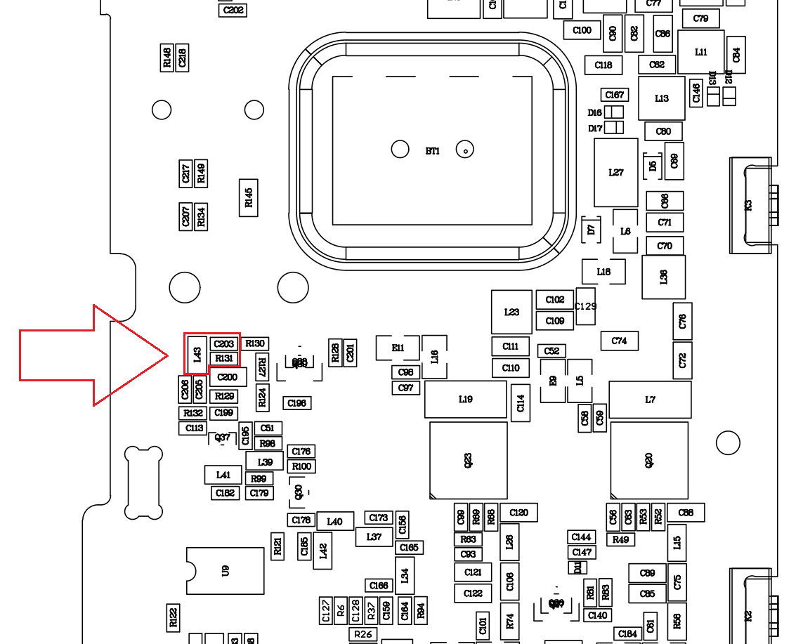

# A36plus_mod
A modification guide for the [Talkpod A36plus](https://talkpod.com/products/talkpod%C2%AE-a36plus-144-430-mhz-uhf-vhf-gmrs-ham-hand-held-transceiver), enabling flat baseband input/output (so-called "9600 baud").
The stock firmware does not support flat baseband in/out, so it is required to flash the device with [OpenRTX](https://github.com/OpenRTX/OpenRTX) open-source alternative firmware.

## Warning
The proposed modification breaks both the RX and TX paths, meaning that it is **no longer possible to use the radio's microphone and speaker**.
The only baseband access is through the Kenwood connector. This mod **does not allow nor enable** the radio to process or generate M17 on its own - an external modem is required.

## The general idea
To access flat baseband, just connect two of the pins of the mod/demod IC with the Kenwood connector. Some parts have to be removed so that the signal is kept clean.

## Modification
1. Remove (desolder) C4 and C148. Both capacitors are located close to the BK4819 chip at the back side of the board.

2. Remove (desolder) L43, R131 and C203. All of these parts are located close together near the Kenwood connector, at the back side of the PCB.

3. Remove (cut away) E15 (a 100uF THT electrolytic capacitor) and desolder the resistor parallel to it (R145, at the other side of the PCB).

4. Connect pins 8 and 13 of the Beken IC with the Kenwood connector.

5. Disconnect the MIC/SPK connector P3.

## Modification overview
Front side of the mainboard

Back side of the mainboard

## Flashing with OpenRTX
### Linux
WIP.

### Windows
Use the official flashing tool from Talkpod. A sample image can be found in the `sample_firmware` directory.
